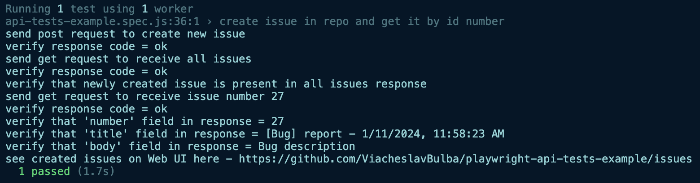

CRUD operations approach can be use to test API

CRUD is an acronym for the four basic operations used to manipulate data:

- Create: Adds new data
- Read: Retrieves data from the source
- Update: Modifies existing data
- Delete: Removes existing data

In a RESTful API environment, CRUD operations correspond to the following HTTP methods:

- POST: Creates a new resource
- GET: Reads a resource
- PUT: Updates a resource
- DELETE: Removes a resource

# Install dependencies

You need to download and install nodeJS first.

Then clone the repo and run in terminal

`cd PROJECT_FOLDER`

`npm install`

# Run tests

`npx playwright test tests/api-tests-example.spec.js`

or, to run an individual test

`npx playwright test -g "POST - create a booking"`

# Log example

# Troubleshooting

If you want to run the tests from IDE directly using "Playwright Test for VSCode" plugin but you do not see your tests under testing tab and you do not see green play/run icon - most likely you opened VS Code from terminal - close it and open it from Applications Launchpad - path environments variables are different in these two cases and that is the reason you don't see it.
